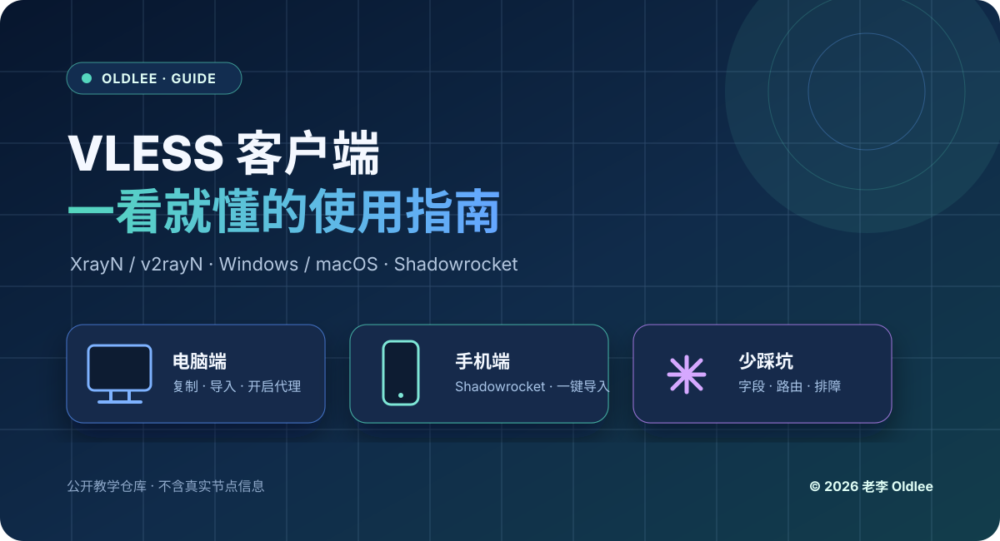

# VLESS 客户端傻瓜式使用指南

## XrayN / v2rayN（Windows、macOS）+ Shadowrocket（iPhone、iPad）

> 一条 VLESS 配置，电脑和手机都能用。照着图做，不需要先学会 Linux。

**版权：© 2026 老李 Oldlee**

## 先说安全规则

这是一个公开教学仓库，**不包含任何真实 IP、UUID、VLESS 链接、API Key、Token、SSH 私钥或代理账号密码**。

- 文档中的 `<VLESS_UUID>`、`<SERVER_HOST>` 等都是占位符，不能直接连接。
- 真实节点只通过私聊、加密密码管理器或本地受保护文件传递。
- 不要把真实 VLESS 链接发到公开 Issue、截图、群聊或公开仓库。
- 遇到“允许不安全”时不要为了省事打开；除非服务端明确要求并且你知道风险。

## 你要看哪一篇

| 需求 | 教程 |
|---|---|
| Windows / macOS 导入 VLESS | [电脑端：XrayN / v2rayN](docs/01-pc-mac-xrayn.md) |
| iPhone / iPad 使用 Shadowrocket | [手机端：Shadowrocket](docs/02-shadowrocket.md) |
| 看不懂 Reality 参数 | [字段对照表](docs/03-vless-fields.md) |
| 导入后超时、没网、速度慢 | [排障清单](docs/04-troubleshooting.md) |

## 30 秒快速开始

1. 从节点提供者处复制**完整的 VLESS 链接**。
2. 打开对应客户端，使用“从剪贴板导入”。
3. 选中节点并启用系统代理或 VPN。
4. 先用 `规则 / Config` 模式测试；仍不确定时临时切到 `全局 / Proxy`。
5. 打开一个普通网页，再检查 IP、延迟和丢包。

## 官方入口

- [v2rayN 官方 GitHub](https://github.com/2dust/v2rayN)
- [Xray-core 官方 GitHub](https://github.com/XTLS/Xray-core)
- [Shadowrocket App Store](https://apps.apple.com/us/app/shadowrocket/id932747118)

下载客户端时优先使用官方项目或 App Store，避免搜索结果中的“破解版”“一键配置包”和来历不明的订阅地址。

## 版权与转载

本仓库的教程文字、示意图和排版版权归 **老李 Oldlee** 所有。转载时请保留作者署名和仓库链接，不得把本仓库的占位符包装成可用节点出售。

© 2026 老李 Oldlee. All rights reserved.
