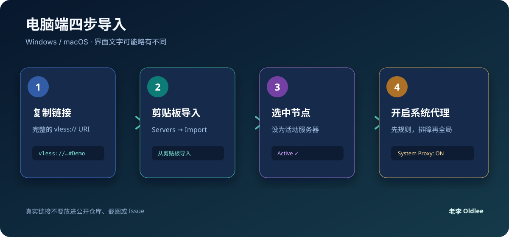

# 电脑端：XrayN / v2rayN 导入 VLESS

适用：Windows、macOS。不同版本的按钮文字可能略有差异，但核心流程一样：**复制链接 → 从剪贴板导入 → 选中节点 → 开启系统代理**。

> 本文把“XrayN”作为 Xray 系客户端的统称。现在更常见的跨平台 GUI 项目是 [v2rayN](https://github.com/2dust/v2rayN)，它支持 Windows、Linux 和 macOS。



## 一、准备一条配置

从节点提供者处取得一条完整的 VLESS URI。公开示例只能长这样：

```text
vless://<VLESS_UUID>@<SERVER_HOST>:<SERVER_PORT>?encryption=none&security=reality&type=tcp&sni=<REALITY_SNI>&fp=chrome&pbk=<REALITY_PUBLIC_KEY>&sid=<REALITY_SHORT_ID>#<NODE_NAME>
```

尖括号里的内容是占位符，不能直接使用。复制真实链接时不要顺手发到公开聊天或截图里。

## 二、Windows 导入

### 1. 安装并打开

1. 从官方 Releases 下载与你的系统匹配的版本。
2. 解压或安装后启动客户端。
3. 第一次运行如果 Windows 防火墙询问网络权限，只允许可信的客户端程序通过。

### 2. 从剪贴板导入

1. 复制完整的 `vless://...` 链接。
2. 打开菜单 **服务器 / Servers**。
3. 选择 **从剪贴板导入服务器**。
4. 列表中出现节点后，双击节点或右键设为活动服务器。

### 3. 开启代理

1. 点击主界面的系统代理开关。
2. 初次测试使用 **规则 / Rule** 模式，日常更省事。
3. 如果某个网站无法判断是否经过代理，临时切到 **全局 / Global**。
4. 测试完成后切回规则模式，不要长期全局跑下载或更新。

### 4. 测试

- 先打开一个普通 HTTPS 网页。
- 再检查客户端日志是否出现 `started`、`accepted` 或类似连接记录。
- 若客户端显示已连接但网页打不开，先看 [排障清单](04-troubleshooting.md) 的 DNS、路由和系统代理部分。

## 三、macOS 导入

### 1. 选择正确版本

- Apple 芯片：选择 `arm64`。
- Intel 芯片：选择 `x64` 或 `amd64`。
- 只从官方项目下载，不要安装来历不明的“增强版”。

### 2. 导入节点

1. 复制完整 VLESS 链接。
2. 打开 XrayN / v2rayN。
3. 选择 **Servers → Import servers from clipboard**，或使用同义的“从剪贴板导入”。
4. 选中新节点并设为活动节点。

### 3. 允许系统代理

1. 在客户端主界面打开 **System Proxy / 系统代理**。
2. 如果 macOS 弹出网络扩展或系统代理提示，确认是你刚安装的客户端后再允许。
3. 用浏览器访问普通网页测试。

> macOS 上“节点已选中”不等于“系统流量已经经过节点”。必须确认系统代理开关已打开。

## 四、不要手动猜参数

如果链接能导入，优先保留链接带来的参数。不要擅自把：

- `reality` 改成 `tls`；
- `tcp` 改成 `ws`；
- `xtls-rprx-vision` 改成其他流控；
- 公钥、短 ID、SNI 改成网上搜索到的值。

这些字段必须和服务端一一对应，猜错就会超时。

## 五、电脑端推荐设置

| 设置 | 推荐 | 说明 |
|---|---|---|
| 路由 | 规则 / Rule | 日常使用，减少不必要的代理流量 |
| 系统代理 | 开启 | 让浏览器和常见应用使用节点 |
| UDP | 按服务端能力 | 不要为了“看起来完整”强行打开 |
| 多路复用 | 先关闭 | 排障时变量更少 |
| TCP Fast Open | 默认 | 只有服务端和系统都支持时再测试 |
| 允许不安全 | 关闭 | REALITY 通常不需要打开 |

## 六、版权

© 2026 老李 Oldlee. 本页只提供客户端使用教学，不提供任何真实节点或代理服务。
