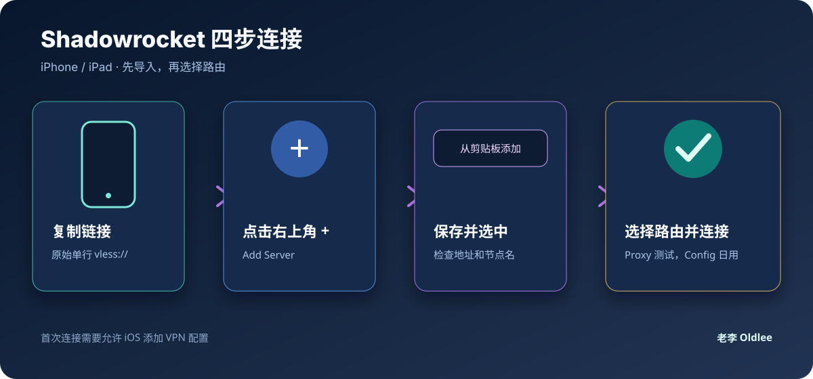

# 手机端：Shadowrocket 导入 VLESS

适用：iPhone、iPad；Shadowrocket 也有 Apple 平台版本。本文只讲客户端操作，不提供节点、不提供订阅、不保存任何真实配置。

## 一、安装与准备

1. 从 [App Store 官方页面](https://apps.apple.com/us/app/shadowrocket/id932747118) 安装 Shadowrocket。
2. 从节点提供者处复制完整的 VLESS 链接。
3. 不要把真实链接贴进公开笔记、公开 Issue 或社交平台。

## 二、最快导入方式：从剪贴板添加

1. 复制完整的 `vless://...` 链接。
2. 打开 Shadowrocket。
3. 点击右上角 **+**。
4. 选择 **从剪贴板添加 / Add from Clipboard**；部分版本会直接识别剪贴板。
5. 检查节点名称和地址，点击保存。
6. 回到首页，点击刚添加的节点。
7. 点击底部开关，首次连接时允许 iOS 添加 VPN 配置。

## 三、手动填写 VLESS + REALITY

如果剪贴板导入失败，选择类型 **VLESS**，再按服务端给出的值填写：

| Shadowrocket 字段 | 填写内容 |
|---|---|
| 地址 / Address | `<SERVER_HOST>` |
| 端口 / Port | `<SERVER_PORT>` |
| UUID | `<VLESS_UUID>` |
| 加密 / Encryption | `none` |
| 流控 / Flow | 服务端给什么就填什么，常见为 `xtls-rprx-vision` |
| 传输方式 / Transport | 服务端给什么就填什么，常见为 `tcp` |
| TLS | 开启 |
| SNI | `<REALITY_SNI>` |
| 公钥 / Public Key | `<REALITY_PUBLIC_KEY>` |
| 短 ID / Short ID | `<REALITY_SHORT_ID>` |
| 指纹 / Fingerprint | 常见为 `chrome` |
| ALPN | 服务端未要求时留空 |
| 允许不安全 | 默认关闭 |

> 公钥、短 ID、SNI、指纹只要有一项不匹配，通常就会表现为连接超时。不要用别人的参数替换。

## 四、路由模式怎么选

Shadowrocket 首页的路由模式名称可能因版本或语言略有不同：

- **配置 / Config**：按照规则决定直连或代理，日常推荐。
- **代理 / Proxy**：尽量让流量走代理，适合临时确认节点是否真正可用。
- **直连 / Direct**：不经过节点，用来做对照测试。

建议顺序：

1. 先选 **代理 / Proxy** 测试节点本身。
2. 能打开网页后切回 **配置 / Config** 日常使用。
3. 如果配置模式下只有部分网站异常，再检查规则和 DNS，不要马上重装客户端。

## 五、连接后检查

- VPN 图标出现，说明系统隧道已建立，不代表远端一定能访问所有网站。
- 打开一个普通网页，再打开 IP 检测页面对比出口地区和 ASN。
- 用 Wi-Fi 和蜂窝数据分别测试一次。
- 若只有 IPv6 节点超时，先切换到 IPv4 节点确认客户端本身正常。

## 六、常见错误

### 导入后显示“编码”或乱码

通常是复制到了 Markdown、富文本或带反斜杠的转义内容。请重新复制原始的单行 `vless://` URI，不要复制代码块边框和多余引号。

### 显示已连接但没有网络

先把路由改成 **代理 / Proxy**，关闭“允许不安全”以外的自定义选项，确认地址、端口、UUID、Reality 公钥和短 ID来自同一条配置。

### 只能打开少数网站

切回 **配置 / Config** 并检查规则；同时确认 DNS 没有被本地网络劫持或配置为空。

## 七、版权

© 2026 老李 Oldlee. 本页只提供 Shadowrocket 客户端教学，不提供任何代理服务。
