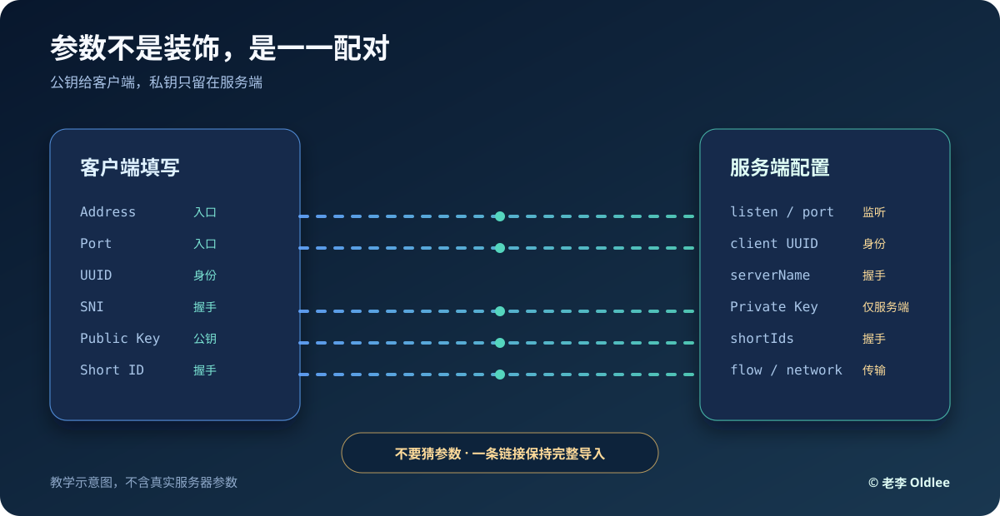

# VLESS + REALITY 字段对照表

这页解决一个问题：为什么把地址、端口、UUID 填了，还是连不上？因为 VLESS 只是协议，REALITY 的传输参数也必须和服务端完全一致。



## 一条脱敏示例

```text
vless://<VLESS_UUID>@<SERVER_HOST>:<SERVER_PORT>?encryption=none&flow=xtls-rprx-vision&security=reality&sni=<REALITY_SNI>&fp=chrome&pbk=<REALITY_PUBLIC_KEY>&sid=<REALITY_SHORT_ID>&type=tcp&headerType=none#<NODE_NAME>
```

这只是格式示例，不能连接任何服务器。

## 参数解释

| 参数 | 作用 | 能不能随便改 |
|---|---|---|
| `vless://` | 协议类型 | 不能 |
| UUID | 客户端身份 | 不能，必须由服务端生成 |
| Address / Host | 服务器入口 | 不能 |
| Port | 服务器端口 | 不能 |
| `encryption=none` | VLESS 常用加密字段 | 按服务端配置 |
| `flow` | XTLS Vision 流控 | 按服务端配置 |
| `security=reality` | 使用 REALITY | 按服务端配置 |
| `sni` | TLS ClientHello 的目标名称 | 不能猜 |
| `fp` | 客户端指纹 | 通常为 `chrome`，以服务端建议为准 |
| `pbk` | REALITY 公钥 | 不能改成私钥或别人的公钥 |
| `sid` | REALITY 短 ID | 不能猜 |
| `type` | 传输类型 | 常见为 `tcp`，必须匹配 |
| `headerType` | TCP 头部模式 | 按服务端配置 |

## REALITY 的关键边界

- 客户端填 **公钥**，服务端保存 **私钥**。
- 客户端不需要也不应该拿到 REALITY 私钥。
- SNI 不是“随便找个热门网站”，要使用服务端配置的值。
- `允许不安全` 不是修复参数错误的万能开关。
- 如果链接已包含参数，优先整条导入，不要手动拆开重填。

## 生成教学占位链接

```text
vless://<VLESS_UUID>@example.com:443?encryption=none&security=reality&type=tcp&sni=example.com&fp=chrome&pbk=<REALITY_PUBLIC_KEY>&sid=<REALITY_SHORT_ID>#Oldlee-Demo
```

`example.com`、占位 UUID、公钥和短 ID 都是教学假值。

© 2026 老李 Oldlee.
